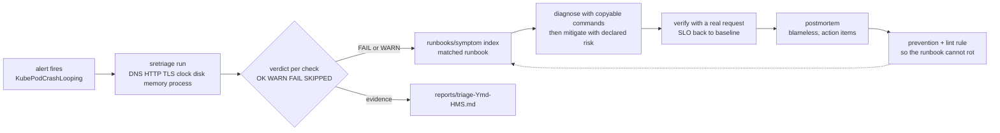

# sre-runbooks-postmortem

Operational runbook library with templates that are validated by machine, plus a triage CLI
(`sretriage`) that runs real checks against real targets and writes an evidence-based report.

[](https://github.com/dayxus/sre-runbooks-postmortem/actions/workflows/ci.yml)
[](LICENSE)
[](pyproject.toml)

## What it does

- Ships 16 runbooks across six operational areas (Kubernetes, cloud, observability, database, CI/CD, network), each with front matter, the nine mandatory sections, copyable commands and an expected time per step.
- Lints every runbook in CI: missing section, section out of order, fenced code without a language, `Diagnóstico` without numbered steps, `Mitigação` without a declared risk, invalid `last_reviewed`, placeholder tokens and broken relative links all fail the build.
- Generates the index in `runbooks/README.md` from the runbooks themselves (`sretriage index`), and fails when it drifts (`sretriage index --check`).
- Runs a real triage: DNS resolution and latency, HTTP status/TTFB/redirects/security headers, TLS expiry and SAN, disk and inode usage, memory pressure, clock skew against a `Date` header, top CPU/memory processes, plus Kubernetes and AWS checks when the tooling and credentials exist.
- Degrades instead of crashing: a missing `kubectl`, an absent AWS credential or an unreachable public target becomes `SKIPPED`, never a failed check.
- Audits external links, runbook staleness (`last_reviewed` older than 180 days) and upstream Kubernetes/AWS CLI versions on a weekly schedule, opening GitHub issues and committing reports only when there is a real diff.

## Why it matters for SRE

A runbook nobody validates is a dead document: it rots quietly and fails the on-call engineer at
3 a.m. This repository treats runbooks and postmortems as artifacts under test — structure, commands
and links are enforced by lint, and the triage CLI produces the same evidence (`OK`/`WARN`/`FAIL`/
`SKIPPED` per check) that the runbook asks you to collect manually, so the SLO impact is measured
instead of guessed. Weekly audits keep `last_reviewed` honest and turn link rot and stale procedure
into tracked issues rather than surprises during an incident.

## Architecture



Why the template is validated by machine: a template only helps if every runbook actually follows it.
`tools/sretriage/runbook_lint.py` is a dependency-free parser that reads the front matter, asserts the
section order, requires a language on every fenced command block, requires a numbered diagnostic path,
a declared mitigation risk, an alert name in `Detecção` and an escalation path, and then resolves every
relative link. The same code backs `sretriage check-runbooks`, `sretriage index` and the test suite, so
the rule set cannot drift between the CLI, CI and the docs.

## Symptom index

Full table, generated by `sretriage index`: [runbooks/README.md](runbooks/README.md).

| Symptom | Runbook | Alert that usually fires | SLO impact |
| --- | --- | --- | --- |
| Pods restarting in a loop | [kubernetes/crashloopbackoff.md](runbooks/kubernetes/crashloopbackoff.md) | `KubePodCrashLooping` | availability |
| Pods stuck in `Pending` | [kubernetes/pending-pods.md](runbooks/kubernetes/pending-pods.md) | `KubePodPendingTooLong` | availability |
| Node `NotReady` | [kubernetes/node-notready.md](runbooks/kubernetes/node-notready.md) | `KubeNodeNotReady` | availability |
| Container killed by OOM | [kubernetes/oomkilled.md](runbooks/kubernetes/oomkilled.md) | `ContainerOOMKilled` | availability |
| Managed node group degraded | [cloud/eks-node-degraded.md](runbooks/cloud/eks-node-degraded.md) | `ManagedNodeDegraded` | availability |
| Object storage throttling (`503 SlowDown`) | [cloud/s3-throttling.md](runbooks/cloud/s3-throttling.md) | `ObjectStorageSlowDown` | latency |
| `too many connections` on a managed database | [cloud/rds-connection-exhaustion.md](runbooks/cloud/rds-connection-exhaustion.md) | `DatabaseConnectionSaturation` | error-rate |
| Replication lag growing | [database/replication-lag.md](runbooks/database/replication-lag.md) | `ReplicationLagHigh` | freshness |
| Application connection pool saturated | [database/connection-pool-saturation.md](runbooks/database/connection-pool-saturation.md) | `PoolSaturation` | latency |
| Dashboards empty for a live service | [observability/missing-metrics.md](runbooks/observability/missing-metrics.md) | `ScrapeTargetDown` | freshness |
| Too many alerts, low signal | [observability/alert-fatigue.md](runbooks/observability/alert-fatigue.md) | `AlertNoiseRatio` | cost |
| Broken but returning `200` | [observability/silent-failure.md](runbooks/observability/silent-failure.md) | `BusinessKpiStalled` | error-rate |
| CI failing intermittently | [cicd/pipeline-flaky.md](runbooks/cicd/pipeline-flaky.md) | `PipelineFlakeRate` | throughput |
| Deploy regressed after rollout | [cicd/deploy-rollback.md](runbooks/cicd/deploy-rollback.md) | `DeployRegression` | availability |
| `no such host` everywhere | [network/dns-failure.md](runbooks/network/dns-failure.md) | `DNSResolutionFailureRate` | availability |
| TLS certificate near expiry | [network/tls-cert-expiry.md](runbooks/network/tls-cert-expiry.md) | `TLSCertificateExpiringSoon` | availability |

## Quickstart

```bash
git clone https://github.com/dayxus/sre-runbooks-postmortem.git
cd sre-runbooks-postmortem
make setup                      # .venv + editable install + pytest + ruff
make test                       # 71 tests
make runbooks                   # lint the runbook library
make triage                     # real triage against example.org and 1.1.1.1, writes reports/
```

Without a virtualenv, run the CLI straight from the checkout:

```bash
PYTHONPATH=tools python3 -m sretriage run --target https://example.org --target-host 1.1.1.1 --out reports/
PYTHONPATH=tools python3 -m sretriage check-runbooks
PYTHONPATH=tools python3 -m sretriage index --check
```

Exit codes: `0` when nothing is in `FAIL`, `1` when at least one check fails, `2` when no target could
be evaluated at all.

## Verify it yourself

Run the triage against a public target and a public resolver (output below is from this checkout on
macOS, Python 3.9.6):

```bash
PYTHONPATH=tools python3 -m sretriage run --target https://example.org --target-host 1.1.1.1 --out reports/
```

```text
sretriage run — alvo(s): https://example.org

| Check | Status | Resumo |
| --- | --- | --- |
| dns | OK | 1.1.1.1 resolved as IP literal |
| dns | OK | example.org -> 104.20.26.136, 172.66.157.237, 2606:4700:10::6814:1a88 in 60 ms |
| http | WARN | https://example.org -> 200 in 82 ms |
| tls | OK | example.org expires in 41 days |
| clock | OK | skew +0.4 s against https://example.org |
| disk | OK | / at 38.7% (worst of space/inodes) |
| memory | OK | 82.7% of RAM in use |
| process | WARN | hottest process /Applications/Google Chrome.app/Contents/Frameworks/Google Chrome Framework.framework/Versions/152.0.7977.83/Helpers/Google Chrome Helper (Renderer).app/Contents/MacOS/Google Chrome Helper (Renderer) at 103.5% CPU / 0.8% MEM |
| k8s | SKIPPED | kubectl not available |
| aws | SKIPPED | no usable AWS credentials or no network path |

sretriage: 10 checks, OK=6 WARN=2 FAIL=0 SKIPPED=2, veredito=ATENÇÃO
report: reports/triage-20260915-214840.md
```

`http` is `WARN` because this host answers `200` without `x-frame-options`/`content-security-policy`,
and `process` is `WARN` because the busiest process was above the fixed CPU threshold at sample time;
`k8s` and `aws` are `SKIPPED` because neither `kubectl` nor usable AWS credentials exist on this
machine. That is the intended behaviour: the run finishes green with evidence instead of guessing.

Lint the whole library:

```bash
PYTHONPATH=tools python3 -m sretriage check-runbooks
```

```text
sretriage check-runbooks — 16 runbooks em runbooks/
  checked runbooks/cicd/deploy-rollback.md
  checked runbooks/cicd/pipeline-flaky.md
  checked runbooks/cloud/eks-node-degraded.md
  checked runbooks/cloud/rds-connection-exhaustion.md
  checked runbooks/cloud/s3-throttling.md
  checked runbooks/database/connection-pool-saturation.md
  checked runbooks/database/replication-lag.md
  checked runbooks/kubernetes/crashloopbackoff.md
  checked runbooks/kubernetes/node-notready.md
  checked runbooks/kubernetes/oomkilled.md
  checked runbooks/kubernetes/pending-pods.md
  checked runbooks/network/dns-failure.md
  checked runbooks/network/tls-cert-expiry.md
  checked runbooks/observability/alert-fatigue.md
  checked runbooks/observability/missing-metrics.md
  checked runbooks/observability/silent-failure.md
links relativos internos: 52 verificados

OK: front matter, seções, comandos e links internos verificados em 16 runbooks
```

Prove the lint is not decorative — delete a mandatory section from a copy and watch it fail:

```bash
sed '/^## Prevenção/,$d' runbooks/kubernetes/oomkilled.md > /tmp/oom.md
python3 - <<'PY'
import sys
sys.path.insert(0, "tools")
from pathlib import Path
from sretriage.runbook_lint import lint_text
text = Path("/tmp/oom.md").read_text()
_, problems = lint_text("runbooks/kubernetes/oomkilled.md", text)
print("\n".join(p.render() for p in problems))
PY
```

The generated index must match the runbooks (this is the check the `docs` CI job runs):

```bash
PYTHONPATH=tools python3 -m sretriage index --check
```

```text
sretriage index --check: runbooks/README.md está atualizado (16 runbooks)
```

## Automated maintenance

`.github/workflows/maintenance.yml` runs every Monday at 06:23 UTC (and on demand) and does real work:

- Audits every external link in runbooks, templates and docs with an identified User-Agent (`HEAD`, then `GET` as a fallback) and writes `reports/link-audit.md`. Dead URLs open the issue *Dead links found in the runbook library* with the file, URL and HTTP status, unless an open issue already tracks it.
- Runs `sretriage check-runbooks` and `sretriage index --check`; a failure opens *Runbook lint failed on schedule* with the literal output.
- Lists runbooks whose `last_reviewed` is older than 180 days in `reports/stale-runbooks.md` and opens *Runbooks pendentes de revisao*.
- Queries the upstream stable versions of Kubernetes (`dl.k8s.io/release/stable.txt`) and AWS CLI v2 (highest `2.x.y` tag) and refreshes `docs/versions.md`.
- Commits `reports/*.md` and `docs/versions.md` only when `git diff --cached` is non-empty, so a week with nothing to report produces no commit at all.

## Project layout

```text
.
├── runbooks/                 # 16 runbooks + generated index
│   ├── kubernetes/ cloud/ observability/ database/ cicd/ network/
│   └── README.md             # generated by `sretriage index`
├── templates/                # postmortem, severity matrix, runbook template, change review
├── tools/
│   ├── sretriage/
│   │   ├── cli.py            # run, check-runbooks, index, version
│   │   ├── runbook_lint.py   # front matter, sections, commands, links, index
│   │   ├── report.py         # markdown triage report
│   │   └── checks/           # dns http tls disk memory clock process k8s aws
│   ├── audit_links.py        # weekly external link and staleness audit
│   ├── update_versions.py    # upstream version refresh
│   └── demo_server.py        # local probe used by the CI triage demo
├── tests/                    # lint, checks against a real local server, report, links, exit codes
├── docs/                     # how to write a runbook, postmortem guide, versions
├── reports/                  # committed audits + per-run triage output (gitignored)
├── Makefile
└── .github/workflows/        # ci.yml and maintenance.yml
```

## Limitations and next steps

- The triage CLI is a local, single-host sampler. It is not an agent and does not run continuously; it samples the host it runs on plus the targets you pass.
- `k8s` and `aws` checks are shallow on purpose (node readiness, pressure conditions, caller identity, RDS instance status). No write actions, no automatic remediation — a runbook is still executed by a human.
- Thresholds are fixed constants (disk 80/90%, memory 85/95%, TLS 30/7 days, clock 5/30 s) and are not configurable yet.
- Check output is Markdown only; there is no JSON output for machine consumption and no history comparison between runs.
- Postmortem and change-review templates are documents, not generators: nothing is rendered into a ticket tool.
- Next steps: `--format json` with a stable schema, per-runbook regression tests that execute the diagnostic commands in a kind cluster, and an option to compare the current report against the previous one to detect slow drift.
- This repository contains no employer, client or internal infrastructure data: every cluster, bucket, database and service name in the runbooks is a synthetic lab example.

---

[Versão em português](README.pt-BR.md)

Part of the [dayxus SRE portfolio](https://github.com/dayxus).
