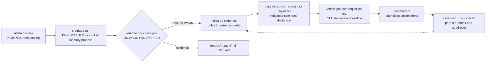

# sre-runbooks-postmortem

Biblioteca de runbooks operacionais com templates validados por máquina, mais um CLI de triagem
(`sretriage`) que roda checagens reais contra alvos reais e escreve um relatório baseado em evidência.

[](https://github.com/dayxus/sre-runbooks-postmortem/actions/workflows/ci.yml)
[](LICENSE)
[](pyproject.toml)

## O que ele faz

- Entrega 16 runbooks em seis áreas operacionais (Kubernetes, cloud, observabilidade, banco de dados, CI/CD e rede), cada um com front matter, as nove seções obrigatórias, comandos copiáveis e tempo esperado por passo.
- Faz lint de todo runbook no CI: seção obrigatória ausente, seção fora de ordem, bloco de código sem linguagem, `Diagnóstico` sem passos numerados, `Mitigação` sem risco declarado, `last_reviewed` inválido, placeholder e link relativo quebrado — tudo isso quebra o build.
- Gera o índice `runbooks/README.md` a partir dos próprios runbooks (`sretriage index`) e falha quando ele sai de sincronia (`sretriage index --check`).
- Roda uma triagem de verdade: resolução DNS e latência, status/TTFB/redirects/headers de segurança HTTP, expiração e SAN do certificado TLS, uso de disco e inodes, pressão de memória, skew de relógio contra o header `Date`, processos que mais consomem CPU/memória, além das checagens de Kubernetes e AWS quando existem ferramenta e credencial.
- Degrada em vez de quebrar: `kubectl` ausente, credencial AWS inexistente ou alvo público inalcançável viram `SKIPPED`, nunca uma checagem falhada.
- Audita semanalmente links externos, runbooks vencidos (`last_reviewed` há mais de 180 dias) e as versões estáveis de Kubernetes e AWS CLI, abrindo issues no GitHub e commitando relatórios apenas quando há diff real.

## Por que isso importa para SRE

Runbook que ninguém valida é documento morto: ele apodrece em silêncio e falha com o plantonista às
3 da manhã. Este repositório trata runbooks e postmortems como artefatos sob teste — estrutura,
comandos e links são exigidos por lint, e o CLI de triagem produz a mesma evidência
(`OK`/`WARN`/`FAIL`/`SKIPPED` por checagem) que o runbook pede para coletar à mão, de modo que o
impacto no SLO é medido, não adivinhado. As auditorias semanais mantêm o `last_reviewed` honesto e
transformam link podre e procedimento desatualizado em issue rastreada, em vez de surpresa durante
o incidente.

## Arquitetura



Por que o template é validado por máquina: template só ajuda se todos os runbooks realmente o
seguirem. `tools/sretriage/runbook_lint.py` é um parser sem dependências que lê o front matter,
confere a ordem das seções, exige linguagem em todo bloco de comando, exige um caminho de
diagnóstico numerado, um risco declarado na mitigação, um nome de alerta em `Detecção` e um
caminho de escalonamento, e resolve cada link relativo. O mesmo código sustenta
`sretriage check-runbooks`, `sretriage index` e a suíte de testes, então o conjunto de regras não
consegue divergir entre CLI, CI e documentação.

## Índice de sintomas

Tabela completa, gerada por `sretriage index`: [runbooks/README.md](runbooks/README.md).

| Sintoma | Runbook | Alerta que costuma disparar | Impacto no SLO |
| --- | --- | --- | --- |
| Pods reiniciando em loop | [kubernetes/crashloopbackoff.md](runbooks/kubernetes/crashloopbackoff.md) | `KubePodCrashLooping` | disponibilidade |
| Pods presos em `Pending` | [kubernetes/pending-pods.md](runbooks/kubernetes/pending-pods.md) | `KubePodPendingTooLong` | disponibilidade |
| Node `NotReady` | [kubernetes/node-notready.md](runbooks/kubernetes/node-notready.md) | `KubeNodeNotReady` | disponibilidade |
| Contêiner morto por OOM | [kubernetes/oomkilled.md](runbooks/kubernetes/oomkilled.md) | `ContainerOOMKilled` | disponibilidade |
| Node group gerenciado degradado | [cloud/eks-node-degraded.md](runbooks/cloud/eks-node-degraded.md) | `ManagedNodeDegraded` | disponibilidade |
| Throttling de object storage (`503 SlowDown`) | [cloud/s3-throttling.md](runbooks/cloud/s3-throttling.md) | `ObjectStorageSlowDown` | latência |
| `too many connections` em banco gerenciado | [cloud/rds-connection-exhaustion.md](runbooks/cloud/rds-connection-exhaustion.md) | `DatabaseConnectionSaturation` | taxa de erro |
| Lag de replicação crescendo | [database/replication-lag.md](runbooks/database/replication-lag.md) | `ReplicationLagHigh` | frescor |
| Pool de conexões da aplicação saturado | [database/connection-pool-saturation.md](runbooks/database/connection-pool-saturation.md) | `PoolSaturation` | latência |
| Dashboards vazios para um serviço vivo | [observability/missing-metrics.md](runbooks/observability/missing-metrics.md) | `ScrapeTargetDown` | frescor |
| Alertas demais, sinal de menos | [observability/alert-fatigue.md](runbooks/observability/alert-fatigue.md) | `AlertNoiseRatio` | custo |
| Quebrado, mas respondendo `200` | [observability/silent-failure.md](runbooks/observability/silent-failure.md) | `BusinessKpiStalled` | taxa de erro |
| CI falhando de forma intermitente | [cicd/pipeline-flaky.md](runbooks/cicd/pipeline-flaky.md) | `PipelineFlakeRate` | vazão |
| Deploy regrediu depois do rollout | [cicd/deploy-rollback.md](runbooks/cicd/deploy-rollback.md) | `DeployRegression` | disponibilidade |
| `no such host` em todo lugar | [network/dns-failure.md](runbooks/network/dns-failure.md) | `DNSResolutionFailureRate` | disponibilidade |
| Certificado TLS perto de expirar | [network/tls-cert-expiry.md](runbooks/network/tls-cert-expiry.md) | `TLSCertificateExpiringSoon` | disponibilidade |

## Começando

```bash
git clone https://github.com/dayxus/sre-runbooks-postmortem.git
cd sre-runbooks-postmortem
make setup                      # .venv + instalação editável + pytest + ruff
make test                       # 71 testes
make runbooks                   # lint da biblioteca de runbooks
make triage                     # triagem real contra example.org e 1.1.1.1, escreve em reports/
```

Sem virtualenv, rode o CLI direto do checkout:

```bash
PYTHONPATH=tools python3 -m sretriage run --target https://example.org --target-host 1.1.1.1 --out reports/
PYTHONPATH=tools python3 -m sretriage check-runbooks
PYTHONPATH=tools python3 -m sretriage index --check
```

Códigos de saída: `0` quando nada está em `FAIL`, `1` quando ao menos uma checagem falha, `2` quando
nenhum alvo pôde ser avaliado.

## Verifique você mesmo

Rode a triagem contra um alvo público e um resolvedor público (a saída abaixo é deste checkout no
macOS, Python 3.9.6):

```bash
PYTHONPATH=tools python3 -m sretriage run --target https://example.org --target-host 1.1.1.1 --out reports/
```

```text
sretriage run — alvo(s): https://example.org

| Check | Status | Resumo |
| --- | --- | --- |
| dns | OK | 1.1.1.1 resolved as IP literal |
| dns | OK | example.org -> 104.20.26.136, 172.66.157.237, 2606:4700:10::6814:1a88 in 60 ms |
| http | WARN | https://example.org -> 200 in 82 ms |
| tls | OK | example.org expires in 41 days |
| clock | OK | skew +0.4 s against https://example.org |
| disk | OK | / at 38.7% (worst of space/inodes) |
| memory | OK | 82.7% of RAM in use |
| process | WARN | hottest process /Applications/Google Chrome.app/Contents/Frameworks/Google Chrome Framework.framework/Versions/152.0.7977.83/Helpers/Google Chrome Helper (Renderer).app/Contents/MacOS/Google Chrome Helper (Renderer) at 103.5% CPU / 0.8% MEM |
| k8s | SKIPPED | kubectl not available |
| aws | SKIPPED | no usable AWS credentials or no network path |

sretriage: 10 checks, OK=6 WARN=2 FAIL=0 SKIPPED=2, veredito=ATENÇÃO
report: reports/triage-20260915-214840.md
```

O `http` fica em `WARN` porque este host responde `200` sem `x-frame-options`/`content-security-policy`,
e `process` fica em `WARN` porque o processo mais ativo passou do limite fixo de CPU no momento da
amostra; `k8s` e `aws` ficam `SKIPPED` porque não existem `kubectl` nem credencial AWS utilizável nesta
máquina. É o comportamento esperado: a execução termina verde, com evidência, em vez de chutar.

Lint da biblioteca inteira:

```bash
PYTHONPATH=tools python3 -m sretriage check-runbooks
```

```text
sretriage check-runbooks — 16 runbooks em runbooks/
  checked runbooks/cicd/deploy-rollback.md
  checked runbooks/cicd/pipeline-flaky.md
  checked runbooks/cloud/eks-node-degraded.md
  checked runbooks/cloud/rds-connection-exhaustion.md
  checked runbooks/cloud/s3-throttling.md
  checked runbooks/database/connection-pool-saturation.md
  checked runbooks/database/replication-lag.md
  checked runbooks/kubernetes/crashloopbackoff.md
  checked runbooks/kubernetes/node-notready.md
  checked runbooks/kubernetes/oomkilled.md
  checked runbooks/kubernetes/pending-pods.md
  checked runbooks/network/dns-failure.md
  checked runbooks/network/tls-cert-expiry.md
  checked runbooks/observability/alert-fatigue.md
  checked runbooks/observability/missing-metrics.md
  checked runbooks/observability/silent-failure.md
links relativos internos: 52 verificados

OK: front matter, seções, comandos e links internos verificados em 16 runbooks
```

Prove que o lint não é decorativo — apague uma seção obrigatória de uma cópia e veja falhar:

```bash
sed '/^## Prevenção/,$d' runbooks/kubernetes/oomkilled.md > /tmp/oom.md
python3 - <<'PY'
import sys
sys.path.insert(0, "tools")
from pathlib import Path
from sretriage.runbook_lint import lint_text
text = Path("/tmp/oom.md").read_text()
_, problems = lint_text("runbooks/kubernetes/oomkilled.md", text)
print("\n".join(p.render() for p in problems))
PY
```

O índice gerado precisa bater com os runbooks (é a checagem que o job `docs` do CI roda):

```bash
PYTHONPATH=tools python3 -m sretriage index --check
```

```text
sretriage index --check: runbooks/README.md está atualizado (16 runbooks)
```

## Manutenção automatizada

O `.github/workflows/maintenance.yml` roda toda segunda-feira às 06:23 UTC (e sob demanda) e faz
trabalho de verdade:

- Audita cada link externo em runbooks, templates e docs com `User-Agent` identificado (`HEAD`, com `GET` como fallback) e escreve `reports/link-audit.md`. URLs mortas abrem a issue *Dead links found in the runbook library* com arquivo, URL e status HTTP, a menos que já exista issue aberta sobre o assunto.
- Roda `sretriage check-runbooks` e `sretriage index --check`; uma falha abre *Runbook lint failed on schedule* com a saída literal.
- Lista os runbooks cujo `last_reviewed` passou de 180 dias em `reports/stale-runbooks.md` e abre *Runbooks pendentes de revisao*.
- Consulta as versões estáveis upstream do Kubernetes (`dl.k8s.io/release/stable.txt`) e do AWS CLI v2 (maior tag `2.x.y`) e atualiza `docs/versions.md`.
- Commita `reports/*.md` e `docs/versions.md` apenas quando `git diff --cached` não está vazio, então uma semana sem novidade não produz commit nenhum.

## Estrutura do projeto

```text
.
├── runbooks/                 # 16 runbooks + índice gerado
│   ├── kubernetes/ cloud/ observability/ database/ cicd/ network/
│   └── README.md             # gerado por `sretriage index`
├── templates/                # postmortem, matriz de severidade, template de runbook, change review
├── tools/
│   ├── sretriage/
│   │   ├── cli.py            # run, check-runbooks, index, version
│   │   ├── runbook_lint.py   # front matter, seções, comandos, links, índice
│   │   ├── report.py         # relatório markdown da triagem
│   │   └── checks/           # dns http tls disk memory clock process k8s aws
│   ├── audit_links.py        # auditoria semanal de links externos e runbooks vencidos
│   ├── update_versions.py    # atualização de versões upstream
│   └── demo_server.py        # probe local usado pela demo de triagem do CI
├── tests/                    # lint, checks contra um servidor local real, relatório, links, exit codes
├── docs/                     # como escrever um runbook, guia de postmortem, versões
├── reports/                  # auditorias commitadas + saída de triagem por execução (gitignored)
├── Makefile
└── .github/workflows/        # ci.yml e maintenance.yml
```

## Limitações e próximos passos

- O CLI de triagem é um amostrador local de host único. Não é um agente e não roda continuamente; ele mede a máquina onde executa mais os alvos informados.
- As checagens de `k8s` e `aws` são rasas de propósito (prontidão de node, condições de pressão, identidade do caller, status de instância RDS). Nada de escrita, nada de remediação automática — runbook ainda é executado por uma pessoa.
- Os limites são constantes fixas (disco 80/90%, memória 85/95%, TLS 30/7 dias, relógio 5/30 s) e ainda não são configuráveis.
- A saída das checagens é só Markdown: não existe saída JSON para consumo por máquina nem comparação de histórico entre execuções.
- Os templates de postmortem e change review são documentos, não geradores: nada é renderizado dentro de uma ferramenta de tickets.
- Próximos passos: `--format json` com schema estável, testes de regressão que executem os comandos de diagnóstico de cada runbook em um cluster kind, e uma opção de comparar o relatório atual com o anterior para detectar deriva lenta.
- Este repositório não contém dado de empregador, cliente ou infraestrutura interna: todo cluster, bucket, banco e serviço citado nos runbooks é exemplo sintético de laboratório.

---

[English version](README.md)

Part of the [dayxus SRE portfolio](https://github.com/dayxus).
